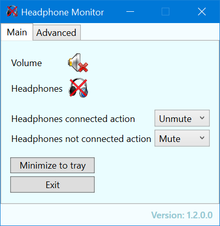

# Headphone Monitor App

## About the app

Monitors headphone connection to PC's line-in audio jack.

App features:
* Detects headphone connection state.
* Shows headphone connection state on app and system tray icon.
* Optional headphone connected and not connected actions (mute/unmute/none).

***Note: the app was tested and works with LENOVO Y50-70 laptop. It did not work on other PC's.***

## About the code

* The program is written in C#.
* The UI is built with WPF.
* NAudio library is used to access audio device properties and events.

## How headphone connection is detected

As far as I know, there is no standard way to detect a line-in audio jack connection for PC's, it is device specific.
I built the app specifically for my LENOVO Y50-70 laptop. To detect a connection change, I used NAudio to read audio device properties and checked what property changed. The property that changed was used to detect a connection change.

## Enhancing the app to be not device-specific

The code is hard coded to work with LENOVO Y50-70 laptop. To make this app work with a different PC would require another version of the app.

There may be a way to overcome the problem of the app being device specific by adding a calibration feature - the user connects and disconnects the headphone and the app learns to detect the connection by testing the audio device properties.
